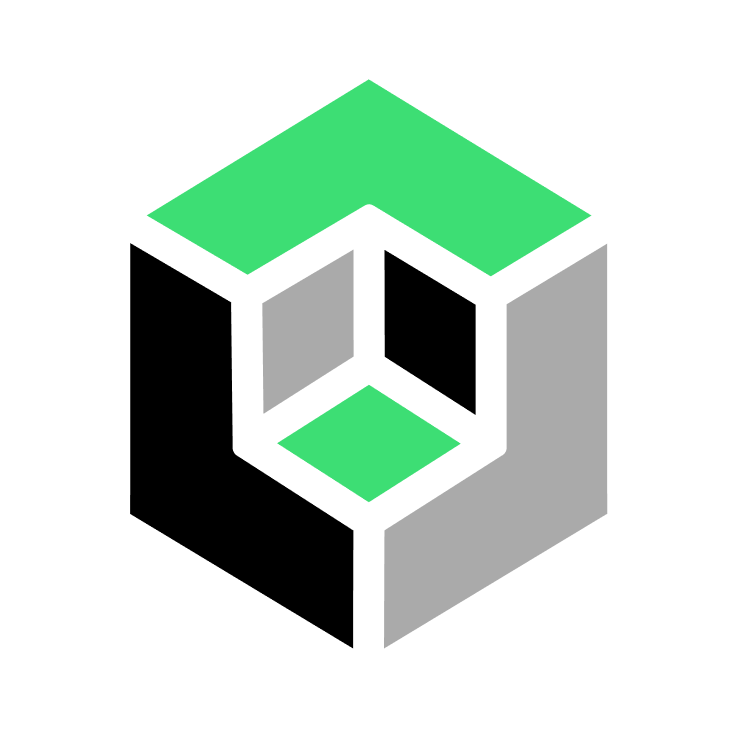

# Blockful brand assets

> _The Blockful logo displayed in the official colors and usage patterns. Do not place the logo on top of other objects and leave a reasonable amount of margin around the outside so the logo is clearly visible._

## Colors
#3DDE74 **Green** (Primary)

#000000 **Black**

#AAAAAA **Gray**

#000000 **White**

## Fonts
[Montserrat](https://fonts.google.com/specimen/Montserrat)

## Logos

[SVG](https://github.com/blockful-io/brand-assets/blob/main/svg/black-written-logo.svg) | [PNG](https://github.com/blockful-io/brand-assets/blob/main/svg/black-written-logo.svg)

[SVG](https://github.com/blockful-io/brand-assets/blob/main/svg/black-written-logo.svg) | [PNG](https://github.com/blockful-io/brand-assets/blob/main/svg/black-written-logo.svg)

[SVG](https://github.com/blockful-io/brand-assets/blob/main/svg/transparent-bg-logo.svg) | [PNG](https://github.com/blockful-io/brand-assets/blob/main/svg/transparent-bg-logo.svg)

[SVG](https://github.com/blockful-io/brand-assets/blob/main/svg/white-bg-logo.svg) | [PNG](https://github.com/blockful-io/brand-assets/blob/main/svg/white-bg-logo.svg)

[SVG](https://github.com/blockful-io/brand-assets/blob/main/svg/black-bg-logo.svg) | [PNG](https://github.com/blockful-io/brand-assets/blob/main/svg/black-bg-logo.svg)

[SVG](https://github.com/blockful-io/brand-assets/blob/main/svg/green-bg-logo.svg) | [PNG](https://github.com/blockful-io/brand-assets/blob/main/svg/green-bg-logo.svg)

[SVG](https://github.com/blockful-io/brand-assets/blob/main/svg/grey-bg-logo.svg) | [PNG](https://github.com/blockful-io/brand-assets/blob/main/svg/grey-bg-logo.svg)

[SVG](https://github.com/blockful-io/brand-assets/blob/main/svg/structural-logo.svg) | [PNG](https://github.com/blockful-io/brand-assets/blob/main/svg/structural-logo.svg)
